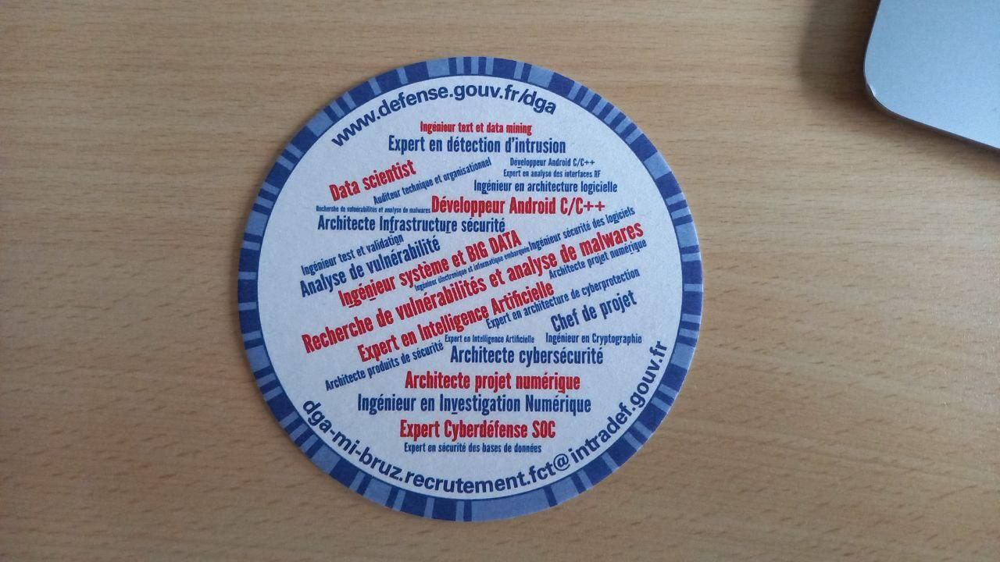
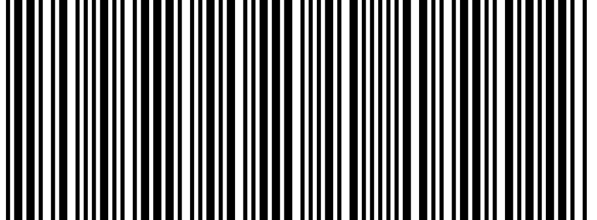

# DG'hAck 2021 : Goodies Lover - 100 pts

## Énoncé 

>**Description**
>
>Rendez-vous au stand DGA lors de l’European Cyber Week qui se tiendra du 16 au 18 novembre 2021 au Couvent des Jacobins à Rennes, un challenge se cache dans un des goodies qui vous seront offerts.
>
>Saurez-vous le retrouver et le résoudre ?

## En quête de goodies

Après avoir visité et discuté au stand de la DGA, on reçoit plusieurs goodies, dont un beau sous-verre. Quand on le retourne, on remarque plusieurs éléments qui pourraient nous laisser penser qu'un message est caché.



On remarque :
 - Le contour du sous-verre a un motif irregulier assez étrange
 - Dans le texte, certaines lettres sont soulignées

On commence par noter les lettres soulignées : `vgfronngjrqqv`\
Peut-être un message à déchiffrer ?

Le contour peut être interprêté comme du morse : les rectangles sont en effet de largeurs différentes évoquant une suite de signaux courts ou longs. Mais le décodage ne donne rien lorsqu'on considère que les motifs foncés portent l'information : la plupart des lettres ne sont pas des symboles réglementaires du morse. On tente alors le décodage en mettant l'information sur la partie claire et obtient deux chaines de caractères en fonction du sens de déchiffrage (on commence en bas où il y a un gros espace clair) :
```
Sens horaire : EERBFEELIDEEBAßTFEUIIEA
Sens anti-horaire : NEIIDELTßNVEEUIFEELVREE
```

Là encore, aucun message ne ressort. On tente alors de déchiffrer ces codes via les techniques de César, Vigenère, en combinant les deux chaînes de caractères, en décodant un message en base64... Mais on n'obtient absolument rien qui pourrait ressembler à un flag.

## Retour au basique

Après avoir trituré ces indices, on commence à penser : peut-être que certaines données ne sont qu'un piège ? Après tout, il est assez classique de cacher l'information que l'on souhaite transmettre au milieu de fausses informations.

Il n'empêche que les chaîne de caractères ne sont pas exploitables en soi... Et si l'interprétation du morse était mauvaise ? En sortant de cette idée, on pense à une roue codeuse mais ça ne marche pas non plus. Ou alors tout simplement un code-barre ?

Alors on tente, on sort LibreOffice Impress puis on dessine des petites barres de largeur variable. Voici le chef-d'oeuvre :



Puis on passe l'image sur le site : https://products.aspose.app/barcode/fr/recognize

Et tadam ! On obtient le flag !! Les lettres soulignées étaient bien là pour nous induire en erreur, quelle fourberie !

> ECWDGHACK
