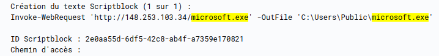
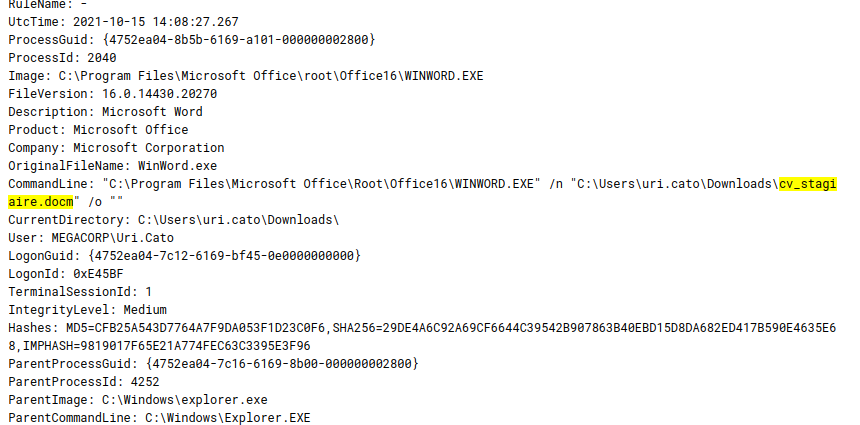
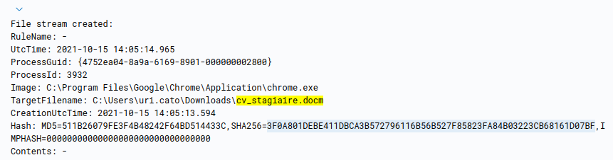
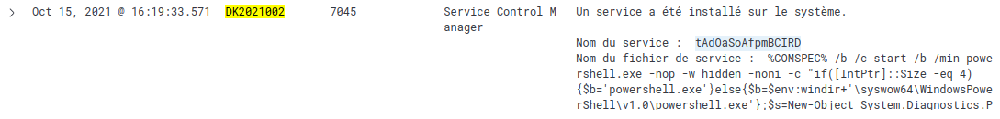
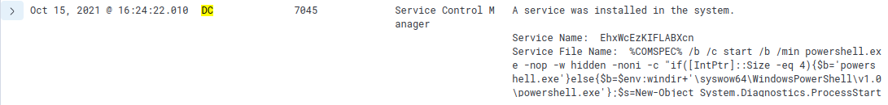
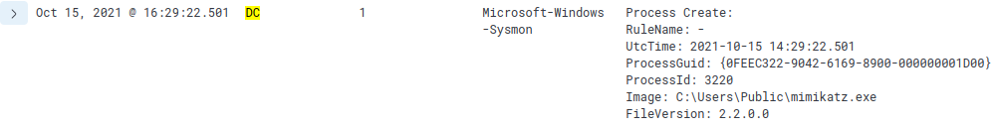

# DG'hAck 2021 : MEGACORP - 200 pts

## Énoncé

> **Description**
>
> L'entreprise MEGACORP, Organisme d'Importance Vitale a subi une attaque informatique.
>
> Plusieurs agents ont déjà tenté en vain d'identifier l'intrusion (infection initiale, mouvement latéral, machines compromises), le temps nous est compté, mais fort heureusement l'entreprise nous a fourni un accès à leurs systèmes de collecte de logs basé sur Kibana (Username : dghack ; Password : dghack2021).
>
> Nous comptons sur vous pour réussir là où les autres ont échoué au plus vite.

Le challenge est séparé en trois sous-challenges indépendants.

## MEGACORP 1 - 50 pts

> Pouvez-vous retrouver le **sha256** du fichier ayant initié la compromission dans le domaine ?

On commence par filtrer les logs selon les échecs d'authentification (log event 4625). On remarque que l'utilisateur `DK2021001` a eu 3 échecs en 30 min. On peut donc penser à une activité suspecte.

En filtrant selon `agent.name = DK2021001`, on observe vers 16h10 une activité très suspecte : un fichier nommé `microsoft.exe` est téléchargé et exécuté dans le dossier `C:\Users\Public\`. Ce nom n'est pas un nom normal et surtout le dossier dans lequel il est présent laisse penser à un malware.

En effet, quand on regarde la suite des logs, on remarque que `microsoft.exe` est exécuté en boucle.

Cependant, l'utilisateur `DK2021001` n'a pas téléchargé ce fichier : le malware s'est probablement introduit via un autre fichier.

En regardant les logs avant 16h10, on remarque que l'utilisateur `DK2021001` consulte plusieurs documents de la suite Office. Un en particulier attire l'attention : `cv_stagiare.docm`, ouvert à 16h08. Il s'agit d'un document Word avec des macros. Or, les macros sont connues comme étant régulièrement des vecteurs de transmission de malware et surtout, il est très étrange d'avoir des macros pour un simple CV...

On retrouve alors le log correspondant au téléchargement de ce document afin d'obtenir le hash. En rentrant, `cv_stagiaire.docm` dans la barre de recherche, on voit que le fichier a été téléchargé à 16h05.

> Flag : DGA{3F0A801DEBE411DBCA3B572796116B56B527F85823FA84B03223CB68161D07BF}

## MEGACORP 2 - 150 pts

> Pouvez-vous retrouver le nom du service ayant permis d'effectuer un pivot vers la machine `DK2021002` ?

On se rend dans les logs liés à `DK2021002` et on remarque une activité suspecte à partir de 16h19.

On observe notammment qu'un service étrange nommé `tAdOaSoAfpmBCIRD` se lance. Il s'agit du service ayant permis l'escalade de privilège.

> Flag : DGA{tAdOaSoAfpmBCIRD}

## MEGACORP 3 - 50 pts

> Pouvez-vous retrouver le **process GUID** du programme ayant été utilisé pour la génération du golden ticket ?

Puisque le programme malveillant va chercher a obtenir un golden ticket, on filtre les logs de `DC` après 16h19.

À 16h24, un service malveillant est lancé : il permet de télécharger le programme malveillant permettant l'obtention du golden ticket.

À 16h29, un processus nommé `mimikatz.exe` est créé : il s'agit de notre programme malveillant. Il ne reste qu'à récupérer son GUID pour avoir le flag.

> Flag : DGA{0FEEC322-9042-6169-8900-000000001D00}
